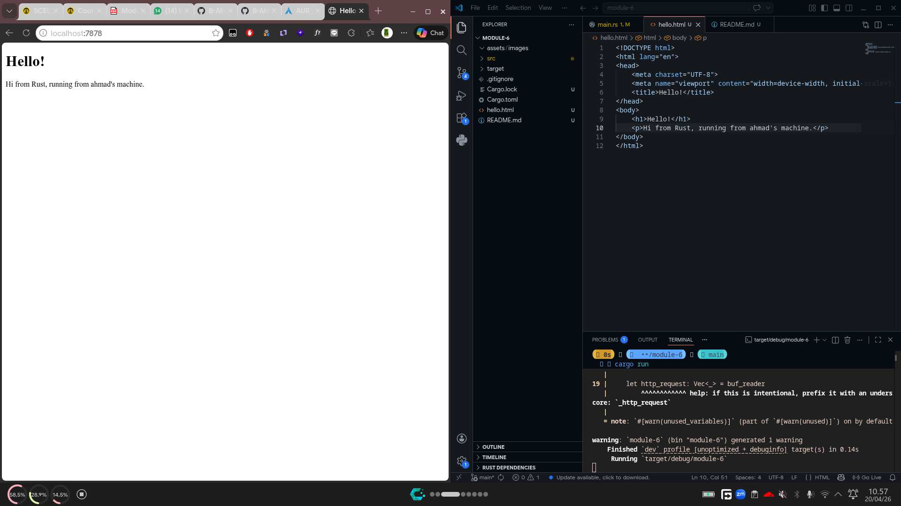

# Commit 1 Reflection
In the `handle_connection` method, we are passing a mutable `TcpStream` which represents the connection between the client and the server. We wrap this stream in a `BufReader` to efficiently read the incoming byte stream line by line. The `http_request` variable is created by reading lines from the `buf_reader`, mapping the `Result` to its underlying `String` using `unwrap()`. Furthermore, we are taking lines until an empty line is encountered, which signifies the end of the HTTP request headers. Finally, we collect these parsed lines into a `Vec<_>` (a vector of strings) and print it. This simple mechanism allows us to inspect the raw HTTP request sent by the browser. We can clearly see the HTTP method (like GET), the path (like /), the HTTP version, and various request headers.

# Commit 2 Reflection

In this commit, the `handle_connection` function is enhanced to actually respond back to the client instead of just printing the request. We define a `status_line` variable containing "HTTP/1.1 200 OK" to indicate a successful HTTP response. Next, we read the contents of the `hello.html` file into a string using `fs::read_to_string`. To comply with the strict HTTP protocol, we must explicitly calculate the `Content-Length` by getting the byte length of our HTML string. We then format the complete HTTP response by combining the status line, the Content-Length header, and the HTML body. A crucial part of this formatting is the double carriage return and line feed (`\r\n\r\n`) used to clearly separate the headers from the main body. This fully formatted string is converted to raw bytes and written back to the `TcpStream` using `stream.write_all()`, effectively sending the webpage to the user's browser.
